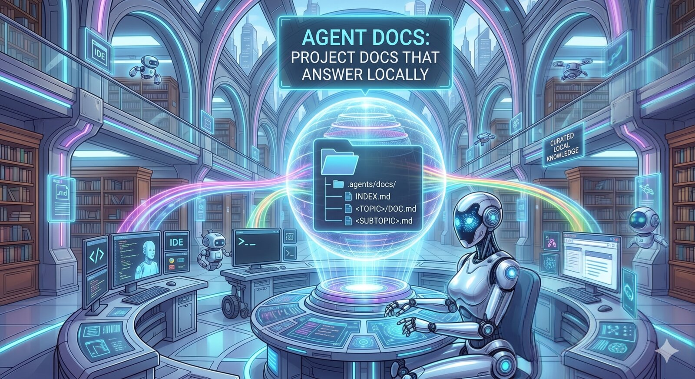

# Agent Docs

[](https://github.com/fmind/agent-docs/actions/workflows/ci.yml) [](./LICENSE) [](https://github.com/anthropics/claude-code) [](https://github.com/google-gemini/gemini-cli) [](https://github.com/features/copilot)



> **Project docs that answer locally before the web.**

**Agent Docs** is a small set of file-based Agent Skills that give a coding agent a curated, on-disk reference for the tools, services, and frameworks your project actually uses. Install once — the same `skills/` tree runs in Claude Code, Gemini CLI, and GitHub Copilot.

**The payoff:** the agent lands on the right upstream URL in one hop instead of N web searches, and every agent on every run gets the same answer for the same question.

## Why this exists

Agents waste a lot of turns web-searching for things the project already commits to.

- Web searches are slow, lossy, and often grab the wrong version of a doc.
- The "right" answer for a given repo is narrower than upstream — flags actually used, patterns this project follows, the canonical URL the team trusts.
- Without curation, two agents researching the same topic on the same repo come back with two different answers.

Agent Docs flips the default: the project ships a tiny, dated reference set under `.agents/docs/`, and agents read it **before** reaching for the web.

## What you get

- **Local-first lookups.** `use-agent-docs` teaches the agent to consult `.agents/docs/INDEX.md` before web research — fewer round-trips, more reproducible answers.
- **Navigation map first.** Each `DOC.md` leads with a structured **documentation map** — the upstream nav, captured as one-line link entries grouped by section — plus a brief summary and key concepts. The agent lands on the right upstream URL in one hop instead of N web searches. Soft cap: ~100 lines per `DOC.md`, ~150 for a subtopic deep-dive.
- **Progressive disclosure.** Default gather is lightweight: one fetch per topic produces the link map. Captured snippets (paste-ready patterns) are opt-in — extended on user request ("deepen X"), or backfilled when `use-agent-docs` fetches upstream for depth and the user opts in.
- **Honest staleness.** Every page opens with YAML frontmatter (`last_verified`, optional `upstream_commit`, `sources.{docs,repo,changelog,release}`). `INDEX.md` propagates the oldest date per topic — agents see the staleness floor at a glance, and tooling can parse it without regex.
- **Smart refresh.** `refresh-agent-docs` reads the frontmatter and short-circuits when upstream hasn't moved (commit-pin match, or no changelog entries newer than `last_verified`); falls through to a link-rot scan of the documentation map. Pages it cannot re-verify get a visible `> ⚠ Stale` banner until the next successful run.
- **Tiered capture.** The documentation map is captured by default (T1: page title + URL + one-line hook, every entry in upstream nav). Paste-ready snippets are captured **on request** with a per-block source link (T2, capped at ~5 per topic). Volatile values (model IDs, pricing, preview flags) are linked, never copied (T3). Captured details are verbatim — never paraphrased, inferred, or auto-completed.
- **Subtopic split when warranted.** Large surfaces (e.g. a CLI's hooks, extensions, MCP servers) get sibling files like `HOOKS.md`, `EXTENSIONS.md` — each with its own refresh clock.
- **Install once, use anywhere.** The same `skills/` tree drives Claude Code, Gemini CLI, and GitHub Copilot.

## The three skills

- **`/gather-agent-docs`** — Seed `.agents/docs/` with a navigation map for the project's key topics (tools, services, frameworks). Default writes `INDEX.md` and one `DOC.md` per topic with summary, key concepts, and a structured link index of upstream pages. On request ("deepen X"), enriches a topic with up to ~5 paste-ready snippets.
- **`/use-agent-docs`** — Before web-searching for a project topic, check `.agents/docs/INDEX.md` and scan the matching `DOC.md`'s documentation map for the right upstream URL. No-op when the file is missing.
- **`/refresh-agent-docs`** — Re-verify entries against upstream: repair dead links in the documentation map, update drifted snippets, bump `last_verified` dates, insert a `> ⚠ Stale` banner when a page can't be re-verified. Default scope is every topic; targets a single topic or `topic/subtopic` when named. Smart-refresh path uses `upstream_commit` / `sources.changelog` to skip work when upstream hasn't changed.

The three pair into a small loop:

```text
gather → use → (drift detected) → refresh → use → ...
       ↘ (depth needed) → deepen ↗
```

## Walkthrough

```text
$ /gather-agent-docs
  → inspects the project (package manifests, CI configs, IaC files), picks 3–8 topics
  → fetches one upstream nav source per topic (sidebar / docs home / sitemap)
  → writes .agents/docs/<topic>/DOC.md with frontmatter, summary, key concepts, documentation map
  → writes .agents/docs/INDEX.md with one dated line per topic
  → "Seeded 5 topics under .agents/docs/. Review the diff before committing."

$ /use-agent-docs       # invoked implicitly whenever the agent is about to web-search
  → reads INDEX.md, opens DOC.md, scans the documentation map for the right entry
  → fetches the matching upstream URL on demand (one hop, not N web searches)
  → optionally backfills a paste-ready snippet to DOC.md's Patterns section if the user opts in

$ /gather-agent-docs deepen gemini-cli
  → revisits gemini-cli's DOC.md; captures up to 5 high-frequency snippets (T2) with inline _Source: …_
  → adds a Patterns section, bumps last_verified

$ /refresh-agent-docs gemini-cli
  → tries the cheap path first: matches upstream_commit / scans sources.changelog since last_verified
  → falls through to a link-rot scan of the documentation map; repairs moved/renamed pages
  → re-verifies any captured snippets against their inline _Source: …_ links
  → "gemini-cli: links repaired (DOC.md), unchanged (HOOKS.md, smart path)."
```

## See it in action

[`examples/`](./examples/) ships a worked sample of what `/gather-agent-docs` produces in an end-user project — two topics (`gemini-cli`, `cloud-run`), one with a deepened subtopic split (`HOOKS.md`). The directory layout matches what the skill writes into your own repo under `.agents/docs/`.

## Install

### Claude Code

```text
/plugin marketplace add fmind/agent-docs
/plugin install agent-docs@agent-docs
```

For local development, point the marketplace at a clone:

```text
/plugin marketplace add /path/to/agent-docs
/plugin install agent-docs@agent-docs
```

### Gemini CLI

```bash
gemini extensions install fmind/agent-docs
```

For local development (live-link, edits reload on next session):

```bash
gemini extensions link /path/to/agent-docs
```

### Antigravity CLI

```bash
agy plugin install https://github.com/fmind/agent-docs
```

For local development (live-link, edits reload on next session):

```bash
agy plugin install /path/to/agent-docs
```

### GitHub Copilot

Copilot CLI:

```bash
copilot plugin marketplace add fmind/agent-docs
copilot plugin install agent-docs@agent-docs
```

For local development, point the marketplace at a clone:

```bash
copilot plugin marketplace add /path/to/agent-docs
copilot plugin install agent-docs@agent-docs
```

VS Code — point `chat.pluginLocations` at a local clone:

```jsonc
// settings.json
"chat.pluginLocations": {
  "/path/to/agent-docs": true
}
```

## Reference

### Layout

```text
agent-docs/
├── AGENTS.md                          # canonical context — read by Copilot; @-included by CLAUDE.md / GEMINI.md
├── skills/                            # Agent Skills (open standard)
│   ├── gather-agent-docs/SKILL.md     # user-facing: seed .agents/docs/
│   ├── use-agent-docs/SKILL.md        # user-facing: read .agents/docs/ before web research
│   └── refresh-agent-docs/SKILL.md    # user-facing: re-verify entries against upstream
├── examples/                          # worked sample of what /gather-agent-docs produces
├── .claude-plugin/                    # Claude Code plugin manifest + bundled marketplace
├── gemini-extension.json              # Gemini CLI extension manifest
├── plugin.json                        # GitHub Copilot manifest
└── .github/workflows/ci.yml           # lint via pre-commit
```

In an end-user project after `/gather-agent-docs`:

```text
.agents/docs/
├── INDEX.md                           # one dated entry per topic, pointing to its DOC.md
└── <topic>/                           # kebab-case slug (e.g. gemini-cli, cloud-run)
    ├── DOC.md                         # entry point: summary, key concepts, documentation map, optional patterns
    └── <SUBTOPIC>.md                  # optional deep dive (e.g. EXTENSIONS.md, HOOKS.md)
```

`INDEX.md`'s per-topic date is the **oldest** `last_verified` among the topic's files (`DOC.md` plus any subtopic files), so the index honestly reflects the staleness floor.

### When to split a subtopic

Each `DOC.md` aims to be a self-sufficient navigation map for the topic (soft cap ~100 lines; ~150 for subtopic deep-dives). Split a subsystem into a sibling `<SUBTOPIC>.md` when **all** of the following hold:

- The subsystem has its own canonical upstream page(s) — distinct from the topic's overview.
- The deepened version (with captured snippets) would push past the soft cap.
- Agents reach for that depth repeatedly in this project, not just hypothetically.

The link map alone rarely justifies a split — surfaces are wide but each entry is one line. Fold a subtopic back into `DOC.md` if it shrinks below its own weight.

## Contributing

Issues and PRs welcome. Two house rules to keep the skills lean:

- **Skill files have line caps** (see `AGENTS.md` §Conventions) — they load into agent context on every run, so verbosity costs budget.
- **Voice is imperative.** Skill bodies address the agent ("Read X, then write Y."), not a human reader — that prose belongs in this README.

## License

MIT — see [LICENSE](./LICENSE).
